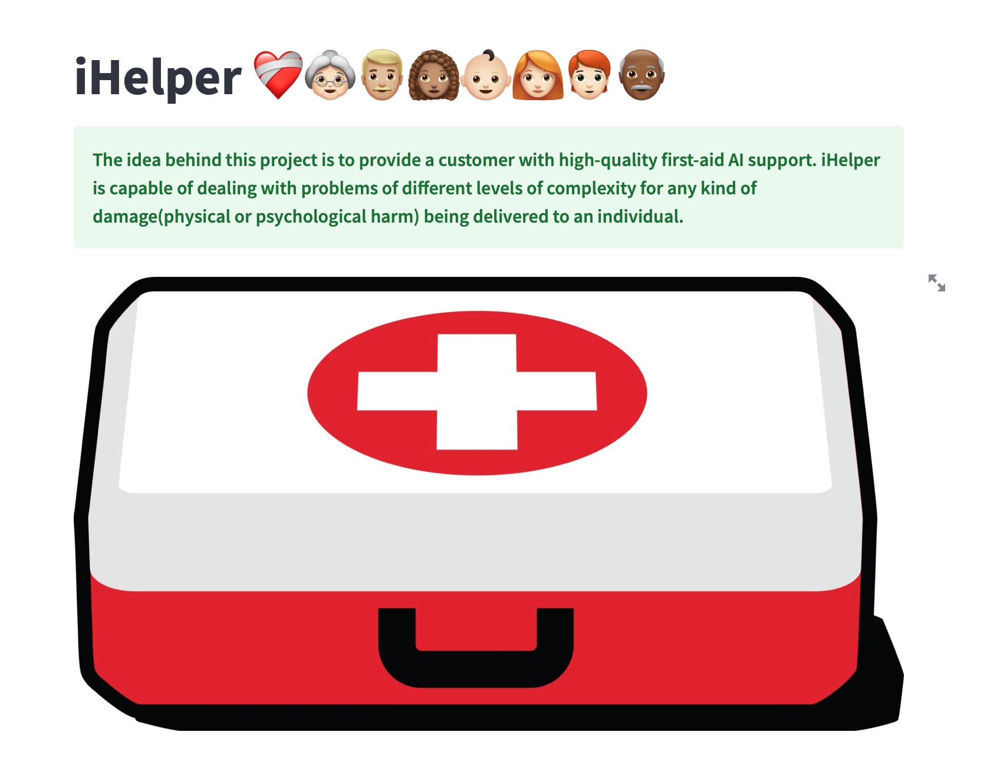
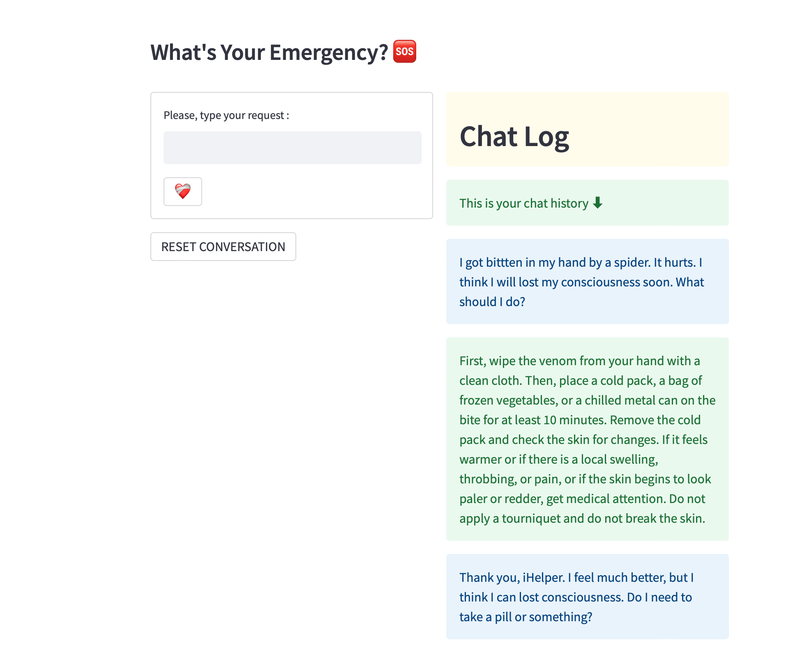

# Final project at SPICED Academy!

 
<h1 align="center">**Here is my final project for data science bootcamp at SPICED Academy, Berlin. The idea behind this project is to provide a customer with high-quality first-aid AI support. iHelper is capable of dealing with problems of different levels of complexity for any kind of damage(physical or psychological harm) being delivered to an individual.**</h1>

Dataset: International Committee of the Red Cross.

**Tech stack for web-app version :** 
- GPT-3
- Streamlit
- Numpy

**Tech stack for SMS texting version :** 
- Twilio
- Render
- Flask
- GPT-3
